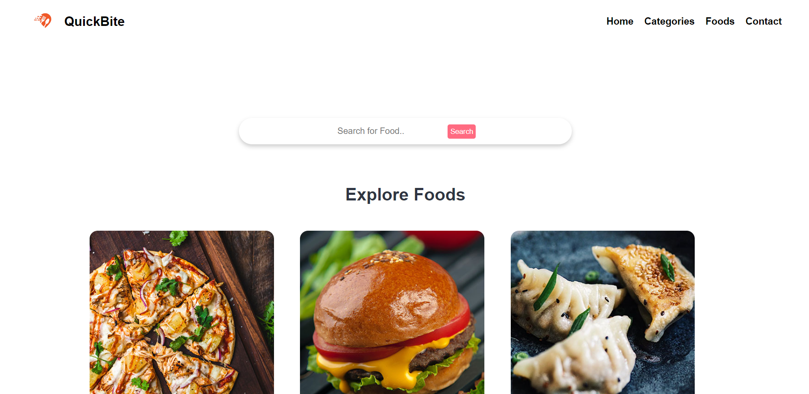

# 🍔 QuickBite: Food Ordering App 🍕

**QuickBite** is a fast and convenient food ordering app built with **MySQL**, **PHP**, and **CSS**. It offers a smooth experience for users to explore food options, place orders, and track them. The admin panel enables restaurant owners to manage orders, users, and food categories effortlessly.

   

## ✨ Live Demo

Check out the live website here: [**QuickBite**](http://quickbite.zya.me/)

## 🌟 Features

### User Side:
- 🛍️ **Browse and Order**: Explore food categories and place orders with ease.
- 🔍 **Search and Filter**: Quickly search for food items and filter results based on categories, prices, and availability.
- 🍽️ **Browse Categories**: Browse through different food categories to find the dishes you crave.

### Admin Panel:
- 📦 **Order Management**: View, update, and manage the status of customer orders.
- 👥 **User Management**: Admin can manage users, view user details, and handle user accounts.
- 🍽️ **Food Categories & Menu**: Easily manage food categories and items, including adding, editing, and deleting them.
- 📊 **Dashboard Overview**: Comprehensive insights into orders and food management.

## 🛠️ Tech Stack

- **MySQL**: Database management to store user, order, and menu data.
- **PHP**: Server-side scripting for handling backend functionality.
- **HTML/CSS**: Styling and structure for a responsive, user-friendly interface.

